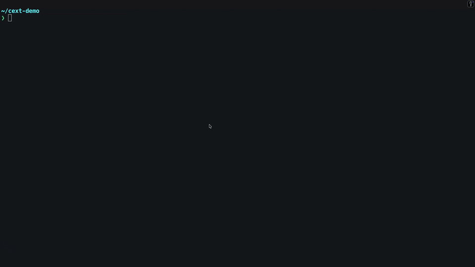

# Chrome Extension Builder

[](https://github.com/harry-harish/chrome-extension-builder/actions/workflows/validate.yml)
[](./LICENSE)
[](#install)
[](https://github.com/harry-harish/chrome-extension-builder/releases)

A Claude Code plugin for building and shipping Manifest V3 Chrome extensions without tripping over the usual stuff: manifest quirks, permission sprawl, CSP mistakes, broken builds, and Web Store submission prep.

It scaffolds new extensions, audits existing ones, adds common extension surfaces, runs validation, and prepares release artifacts. It works with WXT, Plasmo, CRXJS, and vanilla setups, with WXT as the default path.



▶ **[Watch the 73-second narrated walkthrough](./demo/video/launch-narrated.mp4)** (with audio) — scaffold → build → validate → web-ext lint → ship.

## Install

Inside Claude Code, straight from this repo (always the latest release):

```bash
/plugin marketplace add harry-harish/chrome-extension-builder
/plugin install chrome-extension-builder@chrome-extension-builder-marketplace
```

Also on the Anthropic community marketplace (the catalog copy can lag a release behind this repo):

```bash
/plugin marketplace add anthropics/claude-plugins-community
/plugin install chrome-extension-builder@claude-community
```

For local development:

```bash
git clone https://github.com/harry-harish/chrome-extension-builder
claude --plugin-dir ./chrome-extension-builder
```

## Start here

```bash
/chrome-ext:new
```

That launches a guided workflow for planning, scaffolding, validating, testing, and preparing an MV3 extension for release.

## Why this exists

Building the feature is usually not the hardest part of extension work.

The time sink is everything around it: choosing the right framework, structuring background and content logic correctly, keeping permissions tight, satisfying MV3 rules, getting tests to pass, and cleaning things up for Chrome Web Store review. This plugin is built to handle that layer well.

## Commands

- `/chrome-ext:new` — Start a new extension with a guided multi-phase workflow.
- `/chrome-ext:validate` — Run manifest, CSP, permission, and lint checks on the current project.
- `/chrome-ext:add-feature` — Add a popup, options page, content script, side panel, devtools panel, or background handler.
- `/chrome-ext:publish` — Prepare store assets, disclosure text, and packaged output for submission.
- `/chrome-ext:migrate-mv2` — Audit an MV2 codebase and generate an MV3 migration plan.

## Specialist agents

- `extension-architect` — Chooses structure, capabilities, and framework direction.
- `manifest-auditor` — Reviews `manifest.json`, flags risky permissions, checks CSP, and rejects MV2-only patterns.
- `extension-test-runner` — Runs build, lint, and smoke-test workflows in isolation.

## Safety rails

- A `PostToolUse` hook re-checks `manifest.json` changes with manifest, CSP, and permission validators. If a critical issue appears, the session is pushed to fix it before moving on.
- A `PreToolUse` hook blocks live publish commands unless they are explicitly confirmed.
- The plugin defaults to Manifest V3 only.

## Framework support

- WXT — default recommendation
- Plasmo — supported
- CRXJS — supported
- Vanilla MV3 — supported

Use the one that matches your project. The plugin should help you move faster, not force a rewrite for style points.

## Runtime requirements

- Node.js 18+
- pnpm, npm, yarn, or bun
- Python 3.10+ for validator scripts
- Playwright Chromium for E2E tests
- Optional GitHub and Chrome Web Store credentials for publishing flows

## Defaults

- Manifest V3 only
- TypeScript-first output
- `chrome.activeTab` preferred over broad host permissions
- Strict CSP, no remote code, no `eval`
- Reproducible builds
- `_locales`-based i18n by default

## What it checks

The validator path looks for problems that routinely waste time during extension development and review:

- Invalid MV3 manifest fields
- Overbroad or suspicious permissions
- CSP issues like `unsafe-inline` and `unsafe-eval`
- Missing referenced files
- Old MV2 patterns that should not ship
- Packaging and lint problems that break release flow

## Non-goals

This plugin does not:

- Guarantee Chrome Web Store approval
- Publish live by accident
- Make unsafe permissions acceptable
- Turn a weak product idea into a good extension
- Replace framework docs for WXT, Plasmo, or CRXJS

## Known rough edges

- Firefox and Edge workflows are not the primary target yet.
- Existing repos with unusual layouts may need cleanup before automation works well.
- Store submission details can change faster than tooling does.
- Some UI and product decisions still need a human with taste.

## A good fit

This plugin is useful if you are:

- Starting a new MV3 extension
- Migrating older extension code
- Adding features to an existing extension without breaking structure
- Preparing for Web Store submission and want stricter checks before upload

## Repository structure

```text
.claude-plugin/
agents/
commands/
hooks/
skills/
README.md
CHANGELOG.md
LICENSE
PRIVACY.md
```

## Validate before release

```bash
/chrome-ext:validate
```

## License

MIT
